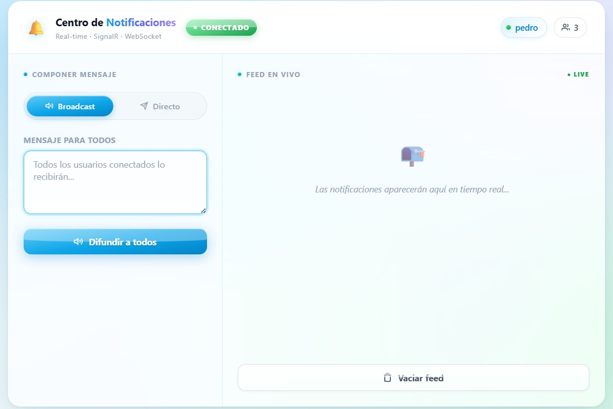
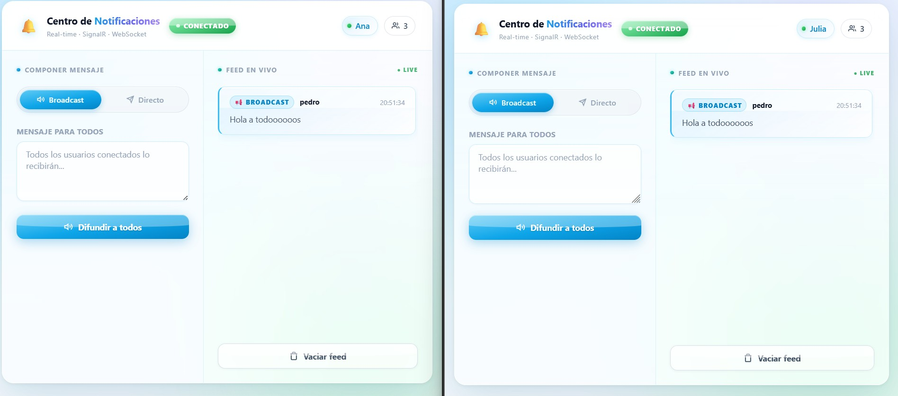
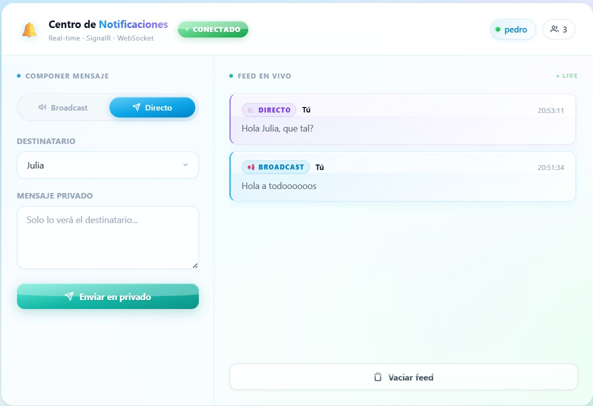
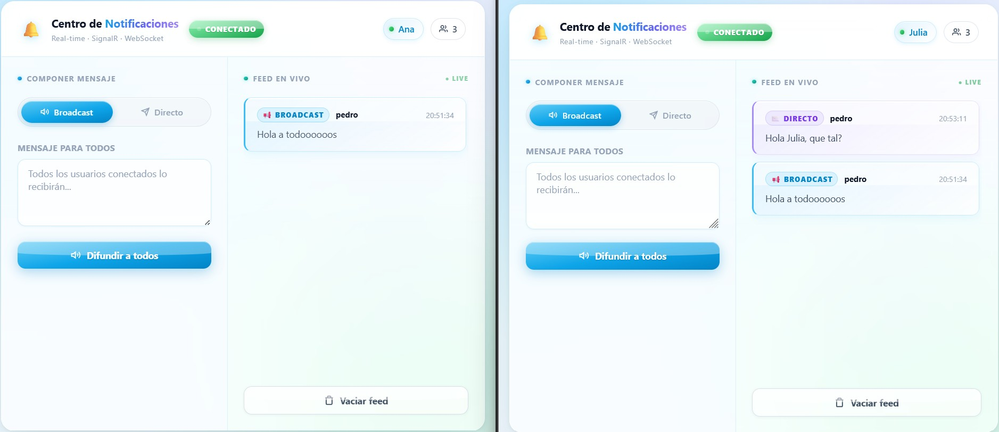

# SignalRNotifications

SignalRNotifications es una aplicación web de ejemplo diseñada para demostrar el uso de **SignalR en ASP.NET Core** mediante un sistema de notificaciones en tiempo real. Permite enviar mensajes instantáneos a todos los usuarios conectados (broadcast) o a un destinatario concreto (mensaje directo), sin recargar la página y sin polling.

## Tecnologías

- **Framework:** ASP.NET Core 8.0 (Minimal API)
- **Tiempo real:** SignalR (WebSocket con fallback a Long Polling)
- **Lenguaje:** C#
- **Frontend:** HTML5, CSS3, JavaScript (Vanilla)
- **Cliente SignalR JS:** @microsoft/signalr 8.0.7

## Características

- **Broadcast:** Envío de notificaciones a todos los usuarios conectados al instante.
- **Mensajes directos:** Envío privado a un usuario concreto mediante grupos de SignalR.
- **Presencia en tiempo real:** Contador y lista de usuarios conectados actualizada automáticamente.
- **Reconexión automática:** El cliente reconecta y se re-registra de forma transparente si se pierde la conexión.
- **Sin base de datos:** Todo el estado vive en memoria. Sin dependencias externas.

## Capturas

### Pantalla principal


### Broadcast en tiempo real (dos navegadores)


### Mensaje privado


### Privado en tiempo real (solo le llega al indicado)


## Instalación

1. Clona el repositorio:
```
git clone <url-del-repositorio>
cd SignalRNotifications
```

2. Restaura las dependencias:
```
dotnet restore
```

3. Ejecuta la aplicación:
```
dotnet run
```

4. Abre el navegador en la URL indicada por la consola (normalmente `http://localhost:5000`).

5. Para probar la comunicación en tiempo real, abre la misma URL en **dos pestañas o dos navegadores distintos**, conéctate con nombres de usuario diferentes y envía notificaciones entre ellos.

## Arquitectura

El proyecto sigue un modelo minimalista basado en **ASP.NET Core Minimal API** con SignalR, organizado de la siguiente manera:

- **Hubs/NotificationHub.cs:** Núcleo de la aplicación. Hereda de `Hub` y contiene los métodos que el cliente puede invocar (`Register`, `SendBroadcast`, `SendDirect`) y los eventos de ciclo de vida (`OnDisconnectedAsync`). Gestiona el estado de usuarios conectados mediante un `ConcurrentDictionary` estático y los grupos de SignalR para el enrutado de mensajes directos.
- **Models/Notification.cs:** Clase de datos que representa una notificación. Incluye el remitente, el mensaje, el tipo (`Broadcast` o `Direct`) y la marca de tiempo. Se serializa automáticamente a JSON camelCase hacia el cliente.
- **Program.cs:** Punto de entrada de la aplicación. Registra SignalR en el contenedor de dependencias, configura la serialización JSON y mapea el Hub en la ruta `/hubs/notifications`.
- **wwwroot/index.html:** Interfaz de usuario de una sola página con panel de login y panel principal. Toda la interacción depende de los IDs del DOM que el JavaScript espera.
- **wwwroot/js/notifications.js:** Cliente SignalR en JavaScript. Construye la conexión, registra los handlers de eventos del servidor y traduce las acciones del usuario en invocaciones al Hub.
- **wwwroot/css/site.css:** Estilos visuales de la aplicación. Completamente independientes de la lógica: pueden modificarse sin afectar al comportamiento.
